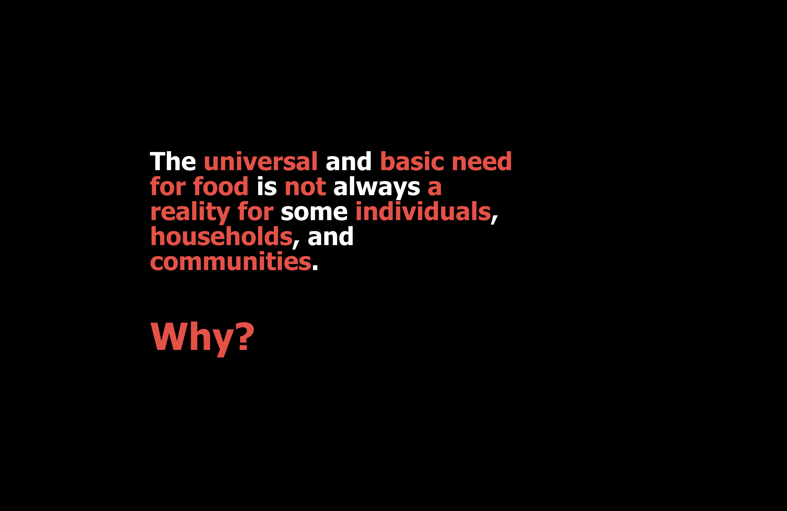
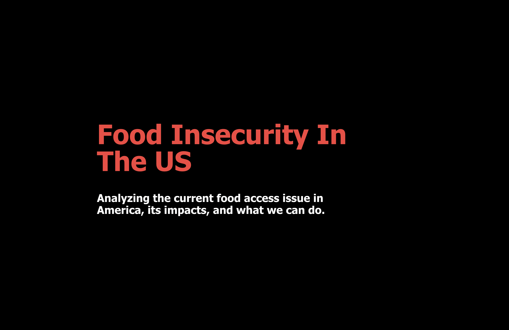
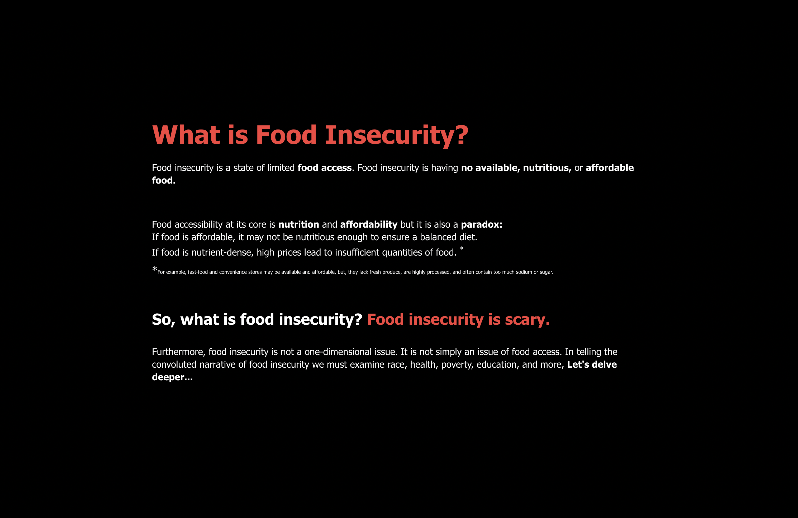
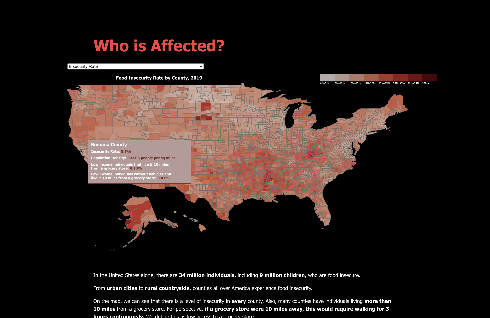
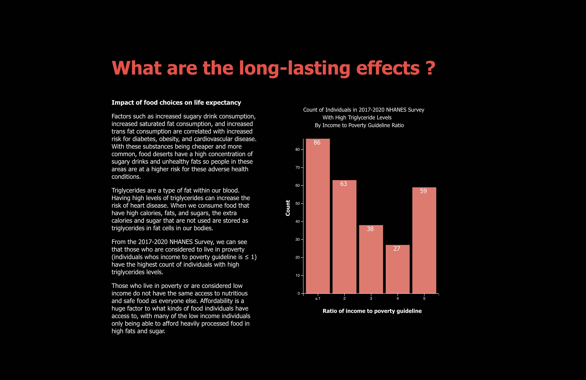
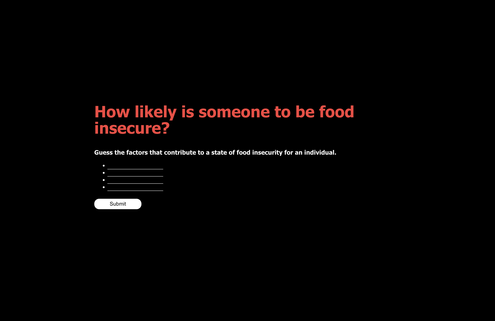
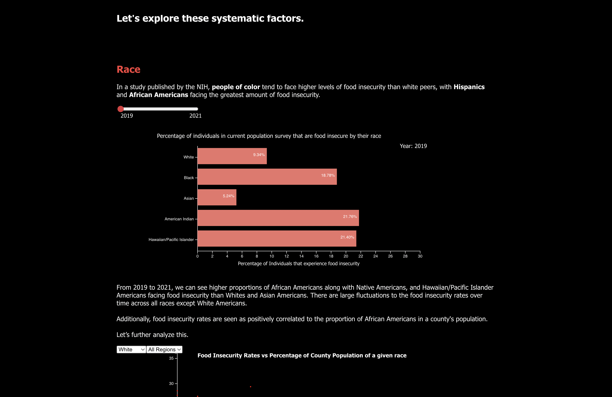
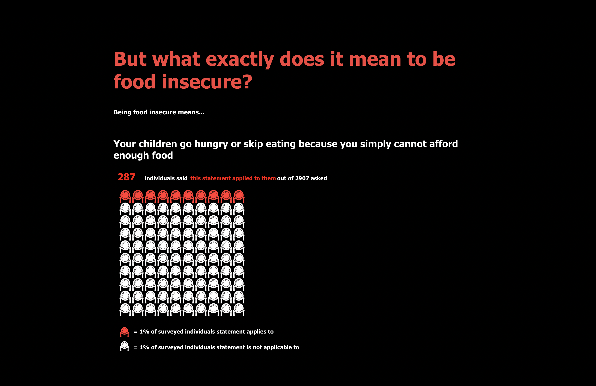
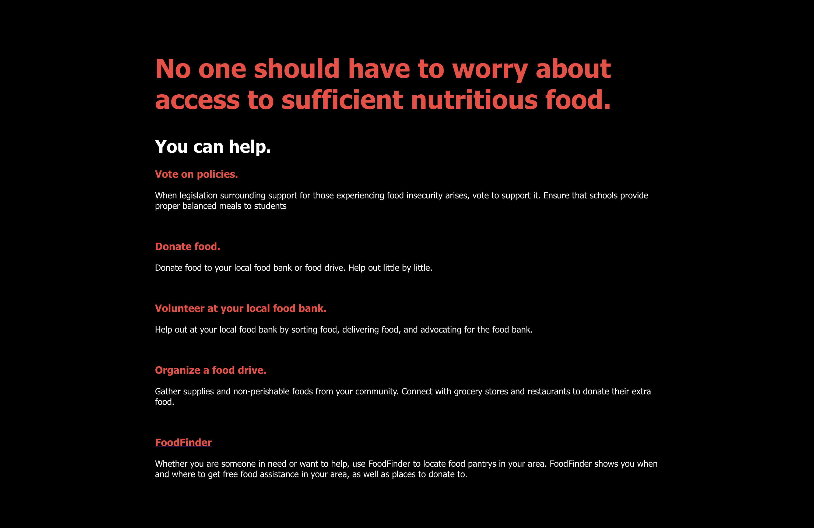

# Food Insecurity in the United States

#### Team Members: Guanjie Cheng, Jessie Chen, Jamie Chan

## Abstract
The universal and basic need for food is not always a reality for some individuals and communities. Food insecurity stems from a lack of food availability, limited food access, and irresponsible food utilization. Food access refers to having available nutritious and affordable food. When there is a lack of food access, the state of food insecurity rises. Nutrition and affordability are the two major components of food accessibility. Even if food is affordable, it may not be nutritious enough to ensure a balanced diet. For example, food deserts occur when those in low-income and urban areas are further than 1 mile from a grocery store. While fast-food and convenience stores may be available and affordable, they lack fresh produce, are highly processed, and often contain too much sodium or sugar to be a sustainable food source. On the other hand, even if within proximity to a grocery store or market, the prices could be too high for an individual to purchase enough food. Within America, this is a prevalent issue among many households as it affects millions. The motivation for our engaging interactive article is to build a narrative that raises awareness and educates others on the harsh realities of food insecurity, its long-lasting effects, and its contributing factors. This is a widespread issue, with many Americans identifying with statements that surround food insecurity. 

## Link to Paper and Video
https://drive.google.com/drive/u/1/folders/1vKwfG-3HQsipxjAGj39GQgILx-7uM400

The Writeup Paper is also in the Github repository called, "Implementation and Design of an Interactive Article For Food Insecurity through Data Visualizations.pdf".

## How to Run
We ran into deployment issues with Github Pages. We discussed and worked with the TA, Fernie, on December 6th during Office Hours to try to get our project up on Github Pages but was not able to get our visualizations to appear. TA Fernie also confirmed that it was okay for us to not host our application.

To run the application, download the repository and run yarn in the terminal. After you have yarn installed, run yarn dev. It will provide a local host link for the application, and you can run it in your browser.

## Project Breakdown
We had a very collaborative development process that made use of individual strengths. Working together, we sourced the data and came up with a narrative that surrounded food insecurity. Jamie and Jessie designed the application prototype and Guanjie and Jessie worked together to implement it. Taking the data we sourced, Guanjie cleaned and sorted the data. Guanjie then developed the visualizations with inputs and feedback from the rest of the team on the design features of the visualization. Jamie worked on further developing the narrative, and Guanjie and Jessie added the text in the application. Jamie took charge of the final write up, and we all worked together to polish the final application and video demo. 

## Summary Images

